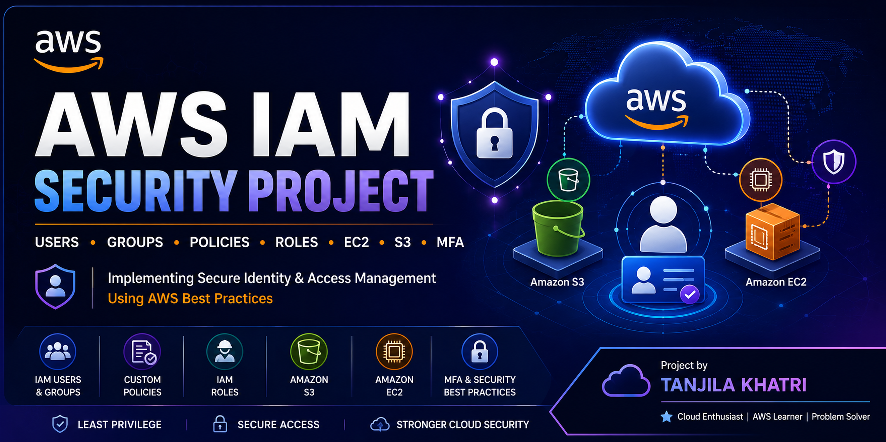
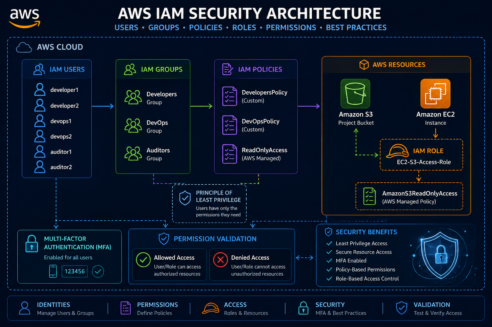

<p align="center">
  
</p>

# 🔐 AWS IAM Security Project


A hands-on AWS cloud security project that demonstrates how to implement Identity and Access Management (IAM) using industry best practices.

This project focuses on creating IAM users, groups, custom policies, IAM roles, Multi-Factor Authentication (MFA), and permission validation to secure AWS resources based on user responsibilities.

---

## 📌 Project Overview

## 📑 Table of Contents

- [Project Overview](#-project-overview)
- [Objectives](#-objectives)
- [AWS Services Used](#-aws-services-used)
- [Project Architecture](#-project-architecture)
- [Project Implementation](#-project-implementation)
- [Project Folder Structure](#-project-folder-structure)
- [Project Screenshots](#-project-screenshots)
- [Security Best Practices](#-security-best-practices)
- [Learning Outcomes](#-learning-outcomes)
- [Future Improvements](#-future-improvements)
- [Author](#-author)

In a real organization, different teams require different levels of access to AWS services. Providing the same permissions to every user can create security risks.

This project simulates a company environment where Developers, DevOps Engineers, and Auditors require different permissions based on their job roles. Using AWS IAM, secure access control is implemented by creating users, groups, policies, and roles while following the Principle of Least Privilege.

---

## 🎯 Objectives

- Create IAM users for different departments.
- Organize users into IAM groups.
- Create and attach custom IAM policies.
- Configure secure access to an Amazon S3 bucket.
- Create an IAM role for an EC2 instance.
- Enable Multi-Factor Authentication (MFA).
- Validate user permissions.
- Implement AWS IAM security best practices.

---

## 🛠 AWS Services Used

- AWS Identity and Access Management (IAM)
- Amazon Simple Storage Service (S3)
- Amazon Elastic Compute Cloud (EC2)
- AWS CloudWatch
- Multi-Factor Authentication (MFA)

---

## 🏗️ Project Architecture

The following diagram illustrates the AWS IAM architecture implemented in this project.

<p align="center">
  
</p>

```
                 AWS Account
                      │
      ┌───────────────┼───────────────┐
      │               │               │
 Developers        DevOps         Auditors
      │               │               │
 Custom Policy   Custom Policy   ReadOnlyAccess
      │
 Amazon S3 Bucket
      │
 EC2 Instance
      │
 IAM Role
```

---

## 🚀 Project Implementation

The following steps were performed to implement secure Identity and Access Management (IAM) in AWS.

### Step 1: Created IAM Users

Created six IAM users to represent different departments within the organization.

**Users Created:**
- developer1
- developer2
- devops1
- devops2
- auditor1
- auditor2

📷 **Screenshot**

<p align="center">
  
</p>

---

### Step 2: Created IAM Groups

Three IAM groups were created to manage permissions efficiently.

**Groups Created:**
- Developers
- DevOps
- Auditors

Each user was added to the appropriate group based on their job role.

📷 **Screenshot**

<p align="center">
  
</p>

---

### Step 3: Created Amazon S3 Bucket

An Amazon S3 bucket was created to store project files and test user permissions.

**Bucket Name**

```
company-project-storage
```

Sample files were uploaded to verify access permissions.

📷 **Screenshot**

<p align="center">
  
</p>

---

### Step 4: Created IAM Policies

Custom IAM policies were created based on the responsibilities of each team.

#### Developers Policy

Allowed permissions:
- List Bucket
- Upload Objects
- Download Objects

#### DevOps Policy

Allowed permissions:
- EC2 Management
- CloudWatch Access
- IAM Read Permissions

#### Auditors

Attached AWS Managed Policy:

- ReadOnlyAccess

📷 **Screenshot**

<p align="center">
  
</p>

---

### Step 5: Created IAM Role

Created an IAM role named:

```
EC2-S3-Access-Role
```

Attached:

```
AmazonS3ReadOnlyAccess
```

The role was assigned to an EC2 instance to provide secure access to the S3 bucket without storing access keys.

📷 **Screenshot**

<p align="center">
  
</p>

---

## 📁 Project Folder Structure

```
aws-iam-security-project
│
├── architecture/
│   └── architecture.png
│
├── policies/
│   ├── developers-policy.json
│   └── devops-policy.json
│
├── screenshots/
│   ├── iam-users.png
│   ├── iam-groups.png
│   ├── s3-bucket.png
│   ├── iam-policies.png
│   ├── iam-role.png
│   └── permission-test.png
│
├── README.md
├── LICENSE
└── .gitignore
```

## 📷 Project Screenshots

### 1. IAM Users

The following screenshot shows the IAM users created for different organizational roles.

<p align="center">
  
</p>

---

### 2. IAM Groups

The following screenshot shows the IAM groups used to organize users based on their responsibilities.

<p align="center">
  
</p>

---

### 3. Amazon S3 Bucket

The following screenshot shows the Amazon S3 bucket created for this project.

<p align="center">
  
</p>

---

### 4. IAM Policies

The following screenshot shows the custom IAM policies created for different user groups.

<p align="center">
  
</p>

---

### 5. IAM Role

The following screenshot shows the IAM role attached to the EC2 instance.

<p align="center">
  
</p>

---

### 6. EC2 Instance

The following screenshot shows the Amazon EC2 instance used in this project.

<p align="center">
  
</p>

---

### 7. Multi-Factor Authentication (MFA)

The following screenshot shows MFA configured for enhanced account security.

<p align="center">
  
</p>

---

### 8. Permission Validation

The following screenshot demonstrates successful permission testing and access validation.

<p align="center">
  
</p>

---

# 💡 Key Skills Demonstrated

- AWS Identity and Access Management (IAM)
- Amazon S3
- Amazon EC2
- IAM Users and Groups
- IAM Roles
- Custom IAM Policies
- Role-Based Access Control (RBAC)
- Principle of Least Privilege
- Multi-Factor Authentication (MFA)
- Permission Validation
- AWS Security Best Practices

  ## 🚧 Challenges Faced

During the implementation of this project, I encountered several practical challenges that helped me understand AWS IAM in greater depth.

- Understanding the relationship between IAM Users, Groups, Roles, and Policies.
- Designing custom IAM policies using the correct JSON syntax.
- Applying the Principle of Least Privilege while granting permissions.
- Configuring IAM Roles for EC2 instances instead of using access keys.
- Testing user permissions and identifying permission-related errors.
- Understanding how AWS Managed Policies differ from Custom Policies.
- Organizing IAM resources according to real-world organizational requirements.

These challenges improved my problem-solving skills and provided practical experience in implementing secure access management within AWS.

## 🎓 Learning Outcomes

After completing this project, I gained practical knowledge and hands-on experience in the following areas:

- Creating and managing IAM Users and Groups.
- Designing and implementing Custom IAM Policies.
- Assigning AWS Managed Policies.
- Creating and attaching IAM Roles to Amazon EC2 instances.
- Managing secure access to Amazon S3 resources.
- Implementing Multi-Factor Authentication (MFA).
- Performing permission validation and troubleshooting access issues.
- Applying Role-Based Access Control (RBAC).
- Following the Principle of Least Privilege.
- Understanding AWS cloud security best practices.

This project strengthened my understanding of Identity and Access Management and increased my confidence in managing AWS resources securely.

## 🚀 Future Improvements

The project can be further enhanced by implementing additional AWS security services and enterprise-level features, such as:

- Integrating AWS Identity Center (AWS IAM Identity Center) for centralized user management.
- Enabling AWS CloudTrail to monitor IAM activities.
- Using AWS Config to ensure continuous compliance.
- Implementing IAM Access Analyzer to identify unnecessary permissions.
- Applying Service Control Policies (SCPs) using AWS Organizations.
- Encrypting Amazon S3 buckets using AWS Key Management Service (KMS).
- Integrating Amazon SNS for security notifications.
- Automating IAM management using AWS CloudFormation or Terraform.

These improvements would make the project more scalable, secure, and aligned with industry best practices.

## 📌 Conclusion

This project successfully demonstrates the implementation of secure Identity and Access Management (IAM) in Amazon Web Services (AWS). By creating IAM Users, Groups, Roles, Custom Policies, and configuring secure access to AWS resources, the project follows industry-standard security practices.

The implementation emphasizes the Principle of Least Privilege, ensuring that users receive only the permissions required to perform their tasks. Permission validation, IAM Roles, and Multi-Factor Authentication further strengthen the overall security of the AWS environment.

Overall, this project provided valuable hands-on experience in AWS cloud security and enhanced my understanding of secure access management, making it a strong foundation for future cloud engineering and security projects.

## 👩‍💻 Author

**Tanjila Khatri**

**Role:** Cloud Computing Student

### Connect with Me

- GitHub: https://github.com/tanjilakhatri/AWS-IAM-Roles-Policies-Permission-Best-Practices/edit/main/README.md
- LinkedIn: https://www.linkedin.com/feed/update/urn:li:activity:7490002829475147776/
---
